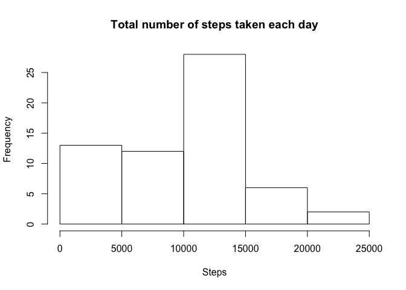
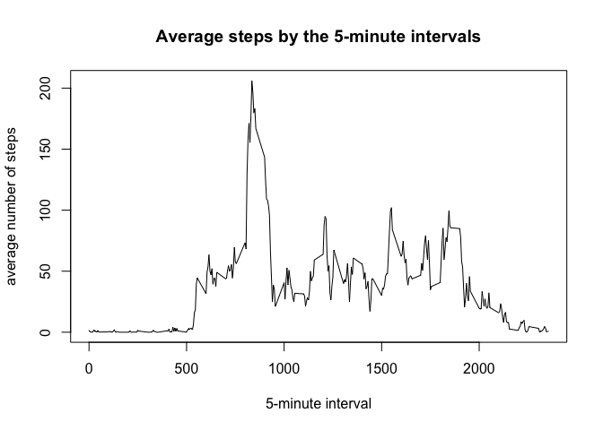
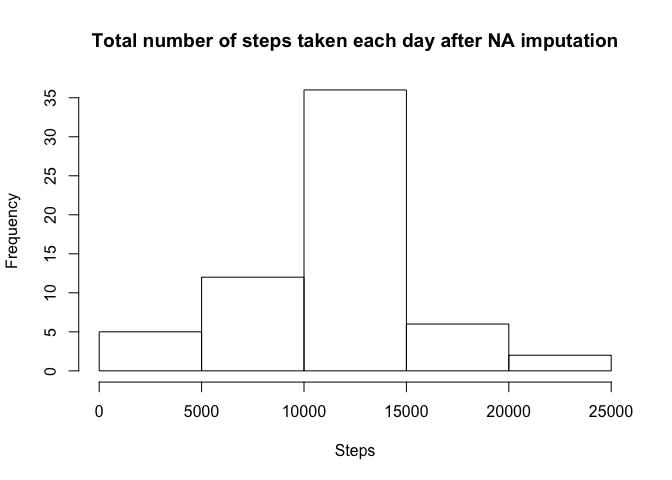
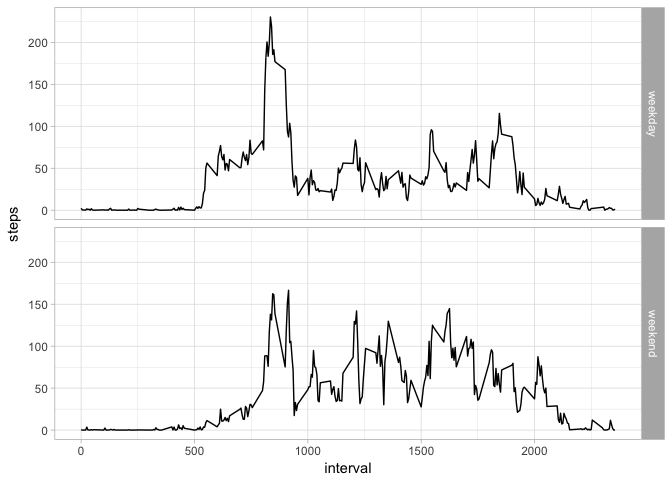

## Loading and preprocessing the data
1. Load the data (i.e. read.csv())


```r
zipped.file <- "activity.zip"
inside.zip <- unzip(zipped.file, list = TRUE)[1,1]
csv.inzip <- unz(zipped.file, inside.zip)
activity <- read.csv(csv.inzip, stringsAsFactors = FALSE)
```

2. Process/transform the data (if necessary) into a format suitable
for your analysis


```r
activity <- transform(activity, date = as.Date(date))
```

***

## What is mean total number of steps taken per day?
1. Make a histogram of the total number of steps taken each day

```r
sum.perday <- tapply(activity$steps, activity$date, sum, na.rm = TRUE)
hist(sum.perday, xlab = "Steps", main = "Total number of steps taken each day")
```

<!-- -->

2. Calculate and report the mean and median of the total number of steps 
taken per day

```r
mean.steps <- as.integer(mean(sum.perday))
median.steps <- median(sum.perday)
```
- Mean of the total number of steps taken per day is **9354**.  
- Median of the total number of steps taken per day is **10395**.

***

## What is the average daily activity pattern?
1. Make a time series plot (i.e. type = "l") of the 5-minute interval (x-axis)
and the average number of steps taken, averaged across all days (y-axis)

```r
mean.interval <- tapply(activity$steps, activity$interval, mean, na.rm = TRUE)
plot(x = names(mean.interval), y = mean.interval, type = "l",
     xlab = "5-minute interval", ylab = "average number of steps",
     main = "Average steps by the 5-minute intervals")
```

<!-- -->

2. Which 5-minute interval, on average across all the days in the dataset,
contains the maximum number of steps?

```r
max.mean.interval <- names(which.max(mean.interval))
```
**835** is the maximum average interval.

***

## Imputing missing values
1. Calculate and report the total number of missing values in the dataset (i.e.
the total number of rows with NAs)

```r
missing.values <- sum(!complete.cases(activity))
```
There are **2304** missing values (i.e. total number of rows with
NAs) in the dataset.

2. Devise a strategy for filling in all of the missing values in the dataset.
The strategy does not need to be sophisticated. For example, you could use the
mean/median for that day, or the mean for that 5-minute interval, etc.

Impute strategy is the number of steps taken by intervals,
averaged across all days

3. Create a new dataset that is equal to the original dataset but with the
missing data filled in.

```r
new <- activity
new$steps <- ifelse(is.na(new$steps), round(mean.interval), new$steps)
```

4. Make a histogram of the total number of steps taken each day and Calculate
and report the mean and median total number of steps taken per day. Do these
values differ from the estimates from the first part of the assignment? What is
the impact of imputing missing data on the estimates of the total daily number
of steps?

```r
hist(tapply(new$steps, new$date, sum), xlab = "Steps",
     main = "Total number of steps taken each day after NA imputation")
```

<!-- -->

```r
sum.impute.perday <- tapply(new$steps, new$date, sum)
impute.mean <- as.integer(mean(sum.impute.perday))
impute.median <- as.integer(median(sum.impute.perday))
```
- Mean steps after imputation: **10765**  
- Median steps after imputation: **10762**  
- Values differ from the estimates from the first part of the assignment.  
- Total daily number of steps increased from 
**570608** to **656704**.

***

## Are there differences in activity patterns between weekdays and weekends?
1. Create a new factor variable in the dataset with two levels -- "weekday" and
"weekend" indicating whether a given date is a weekday or weekend day.

```r
dec.week <- format(new$date, "%u")
dec.week.fctr <- factor(ifelse(dec.week > 5, "weekend", "weekday"))
new$week <- dec.week.fctr
```

2. Make a panel plot containing a time series plot (i.e. type = "l") of the
5-minute interval (x-axis) and the average number of steps taken, averaged
across all weekday days or weekend days (y-axis). The plot should look something
like the following, which was created using simulated data:

```r
w.split <- split(new, new$week)
w.mean <- sapply(w.split, function(x) with(x, tapply(steps, interval, mean)))

require(data.table)
w.mean.melt <- data.table::melt(w.mean)
names(w.mean.melt) <- c("interval", "week", "steps")

require(ggplot2)
ggplot(w.mean.melt, aes(x = interval, y = steps)) +
        geom_line() +
        facet_grid(week ~ .) +
        theme_light()
```

<!-- -->
